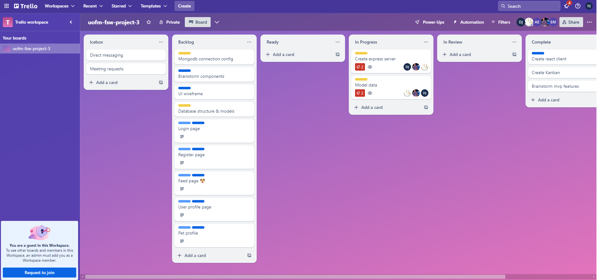
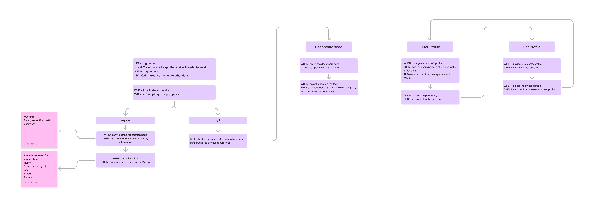

> # Dogalogue

  > ## Table of Contents

  1. [Description:](#description)
  2. [Installation:](#installation)
  3. [Usage:](#usage)
  4. [How to Contribute:](#how-to-contribute)
  
  6. [Test Instructions:](#test-instructions)
  7. [Questions:](#questions)

  > ## Description

This website will be for dog owners who are looking to meet other folks who have dogs. Socialization is extremely important for dogs, and sometimes owners may not know of others to socialize with. This website will be a great place to get to know other dog owners and to create bonds and furry friendships for your special little pal/s.

> ## Screenshots
>
### Homepage


### Trello Kanban



### User Stories and Flowchart



### Remi "The Inspiration" Engelsgjerd


### A Dog Park


### User Story

```md
AS a dog owner, 
I WANT a social media app that makes it easier to meet other dog owners 
SO I CAN introduce my dog to other dogs.
```

## Acceptance Criteria

```md
GIVEN a MERN stack Social Media application for dogs
WHEN I navigate to the site
THEN I can either register as a new user or sign in if already registered 
WHEN I arrive at the registration page
THEN I am greeted to a form to enter my information (Email, name (first, last), and passport)
WHEN I submit my info and is validated
THEN I am required to enter at one pet's information name (first last), size (xs, sm, md, lg, xl), Age, Breed, PhotoUrl
WHEN I to log in
THEN I am presented with a form where I can enter my email and password
When I enter my email and password correctly 
Then I am brought to the dashboard/feed. Otherwise, I am given appropriate error message
WHEN I navigate to a user’s profile
THEN I see the user’s name, a short biography about them
AND each pet that they own (picture and name)
WHEN I click on the pet’s entry
THEN I am brought to the pet’s profile
WHEN I navigate to a pet’s profile
THEN I am shown that pet’s info
WHEN I select the owner’s profile
THEN I am brought to the owner’s user profile
```

 > ## Installation

There are no installation steps for this application. Simply click the link deployed to Render, LINK.
In order to install this program, you can clone the repository titled Dogalogue on GitHub. Once you’ve cloned the repository into your local system, type “npm i” or “npm install” to install the required packages.

> ## Usage

Once you’ve started the deployed application. You will be prompted to register an account. You will enter your email and password to create an account. Once logged in, you’ll be able to search for dogs you want your best friend to socialize with.

> ## Contributors

[Dia Jubara](https://github.com/djubara)

[Erin Mulcahey](https://github.com/emulcahey)

[Alex Engelsgjerd](https://github.com/atengelsgjerd)

[Cole Pattersons](https://github.com/colepatters)

[Davison Hernandez](https://github.com/davisonchs)
  
  > ## How to Contribute

  Create a pull request or raise an issue.
  
  > ## Test Instructions

  N/A
  
  > ## Questions

  If you have any question please visit my GitHub at: [djubara](https://github.com/djubara) or send me an email to: <djubara@hotmail.com>
